# Звіт з виконання WebGoat

## Завдання: (A01) Broken Access Control -> Hijack a session

### Мета
Передбачити або підібрати ідентифікатор сесії (`hijack_cookie`) іншого користувача для отримання несанкціонованого доступу до автентифікованої сесії.

### Хід виконання

1. **Отримання початкового ідентифікатора:**
   Зроблено легітимний запит на авторизацію в завданні. За допомогою Burp Suite (вкладка HTTP history) перехоплено POST-запит до `/WebGoat/HijackSession/login`. У відповіді сервера отримано початкове значення `hijack_cookie`.

   *Скріншот 1: Перехоплений запит із початковою кукою*
   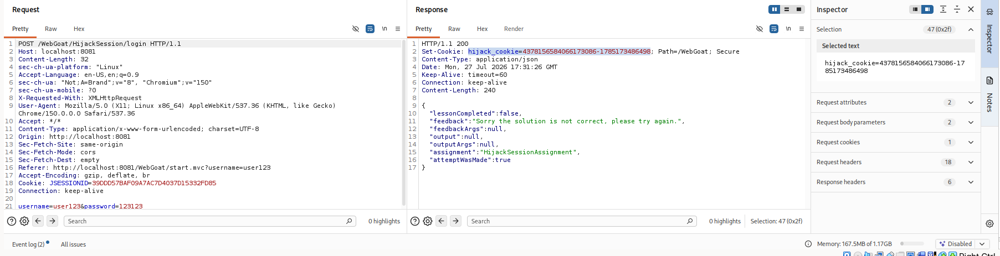

2. **Налаштування вектора атаки (Burp Suite Intruder):**
   Запит відправлено до інструменту Intruder. У вкладці **Positions** виділено частину куки, яка відповідає за лічильник сесій (останні цифри перед дефісом), та встановлено маркери `§` для автоматичного перебору.

   *Скріншот 2: Налаштування Payload Positions*
   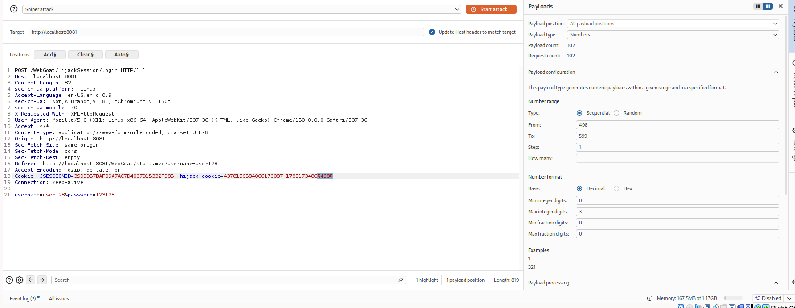

3. **Підбір ідентифікатора (Брутфорс):**
   У вкладці **Payloads** обрано тип *Numbers* та налаштовано діапазон для перебору значень лічильника. Під час атаки знайдено запит, відповідь на який відрізнялася за довжиною (Length). У тілі відповіді сервер повернув `"lessonCompleted": true`.

   *Скріншот 3: Результати перебору в Intruder з успішним запитом*
   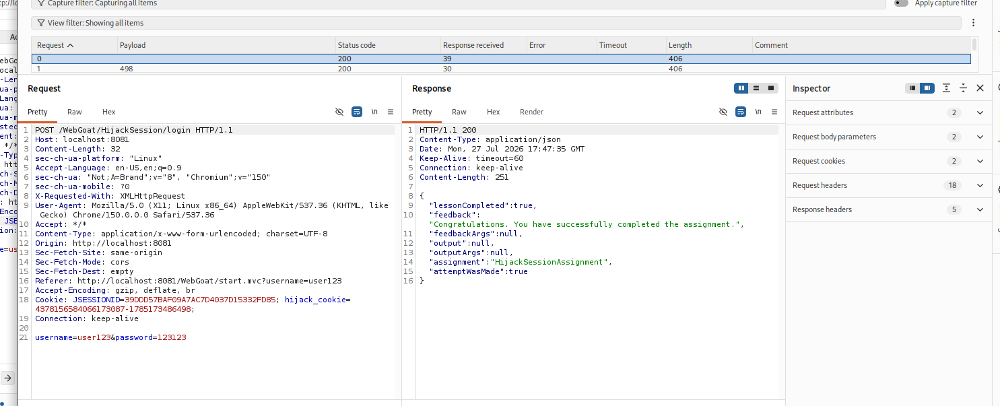

4. **Успішне завершення:**
   Після успішного підбору на сервері, сторінка завдання в браузері відобразила повідомлення про успішне проходження.

   *Скріншот 4: Виконане завдання у WebGoat*
   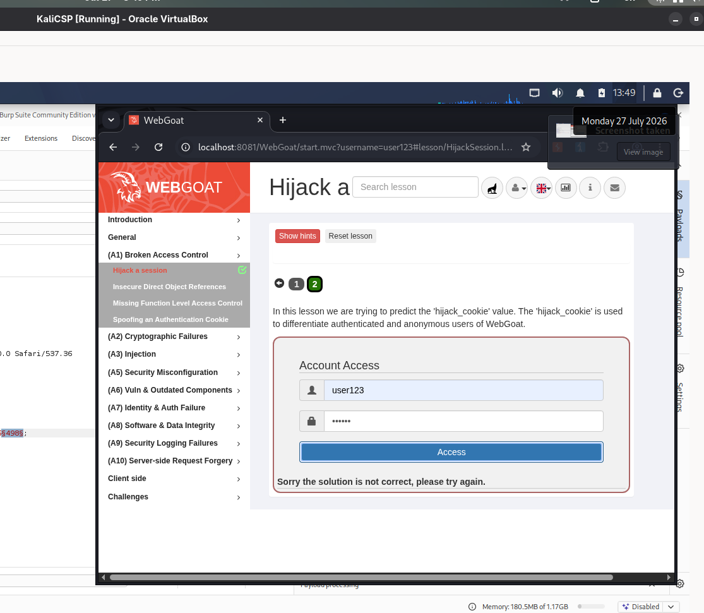

## Завдання: (A01) Broken Access Control -> Insecure Direct Object References (IDOR)

### Мета
Знайти приховані параметри об'єктів (ідентифікатори користувачів) у відповідях сервера та використати їх для несанкціонованого перегляду та модифікації даних інших користувачів (Buffalo Bill).

### Хід виконання

1. **Спостереження за прихованими даними (Observing Differences & Behaviors):**
   Після легітимної авторизації, за допомогою Burp Suite було перехоплено запит до профілю користувача. У JSON-відповіді сервера знайдено приховані атрибути, які не відображаються у веб-інтерфейсі (зокрема `userId` та `role`).
   *Скріншот 1: Вікно Response у Burp Suite (або перехоплений запит), де видно userId (наприклад, 2342384) та role.*
   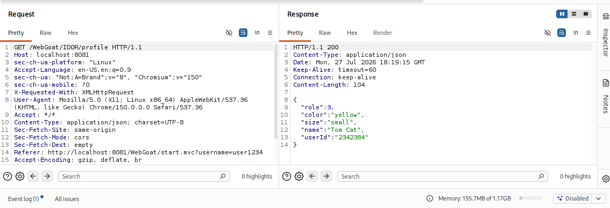

2. **Вгадування шаблонів (Guessing & Predicting Patterns):**
   На основі знайденого `userId` сформовано прямий шлях до об'єкта. Введено альтернативний шлях `WebGoat/IDOR/profile/2342384` для доступу до власного профілю через пряме посилання, що підтвердило вразливість REST-архітектури до маніпуляцій з ідентифікаторами.
   *Скріншот 2: Виконаний 4-й крок у WebGoat із правильним введеним шляхом.*
   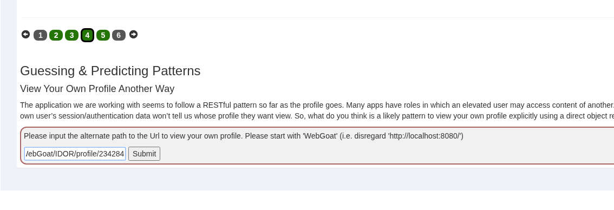

3. **Перегляд та редагування чужого профілю (View & Edit Another Profile):**
   Запит на перегляд профілю було відправлено до інструменту Repeater у Burp Suite.
   *   **View:** Для доступу до чужого профілю ідентифікатор в URL було змінено на `2342388` (Buffalo Bill) у GET-запиті.
   *   **Edit:** Для редагування профілю HTTP-метод було змінено з `GET` на `PUT`, додано заголовок `Content-Type: application/json`, а в тіло запиту передано модифіковані дані зі зменшеними привілеями (`"role": 1`) та іншим кольором (`"color": "red"`).
   
   *Скріншот 3: Успішний PUT запит у вкладці Repeater із тілом запиту та відповіддю "lessonCompleted": true.*
   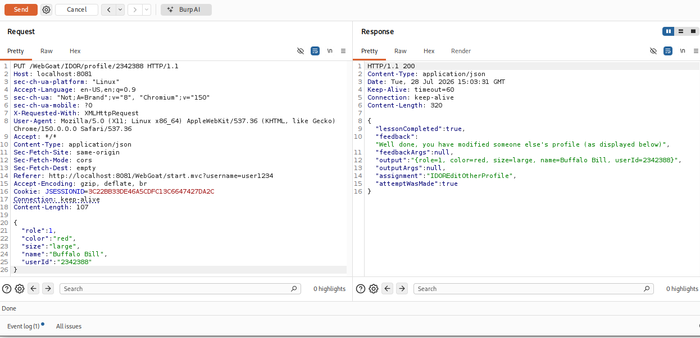

4. **Успішне завершення:**
   Після успішного виконання маніпуляцій з ідентифікаторами завдання було повністю зараховано платформою.
   *Скріншот 4: Виконане завдання (усі індикатори кроків зелені) у WebGoat.*
   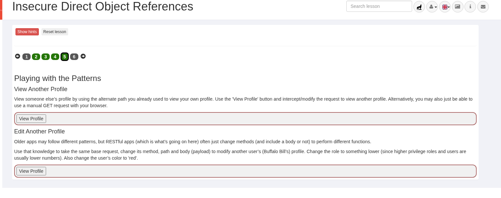

## Завдання: (A03) Injection -> SQL Injection (intro)

### Мета
Проексплуатувати вразливість SQL-ін'єкції для порушення доступності даних (Compromising Availability), виконавши несанкціоновану команду видалення таблиці з бази даних.

### Хід виконання

1. **Аналіз вразливого поля:**
   На етапі 12 (Compromising Availability) виявлено, що поле вводу `Action contains` для пошуку логів не обробляє належним чином спецсимволи і дозволяє виконувати кілька SQL-запитів підряд (шляхом розділення їх крапкою з комою `;`).

2. **Формування вектора атаки (Payload):**
   Для експлуатації було використано техніку об'єднання команд (Chaining). Перша частина корисного навантаження закриває легітимний запит і робить його завжди істинним (`Smith' OR '1' = '1'`), а друга частина передає базі даних деструктивну команду на видалення таблиці (`; DROP TABLE access_log;`).

3. **Експлуатація (SQLi):**
   У вразливе поле пошуку було введено наступний payload:
   `Smith' OR '1' = '1'; DROP TABLE access_log;`

4. **Успішне завершення:**
   Сервер прийняв та виконав ін'єкцію, повністю видаливши таблицю `access_log`. Платформа WebGoat підтвердила успіх атаки відповідним системним повідомленням про порушення доступності даних.

   *Скріншот 1: Успішно виконана SQL-ін'єкція з видаленням таблиці (Drop Table).*
   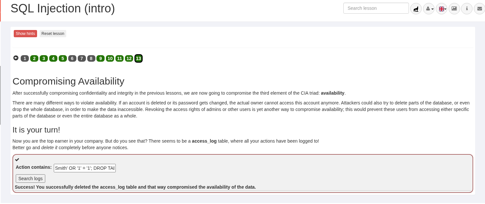

## Додаткове завдання на вибір (OWASP Top 10): (A10) Server-Side Request Forgery (SSRF)

### Мета
Проексплуатувати вразливість SSRF (підробка запиту з боку сервера), маніпулюючи параметрами запиту для отримання доступу до внутрішніх або зовнішніх ресурсів від імені сервера.

### Хід виконання

1. **Перехоплення та модифікація ресурсу (Крок 2):**
   На другому кроці завдання необхідно було змінити зображення, яке відображається сервером. За допомогою Burp Suite (інструмент Intercept) було перехоплено POST-запит під час натискання кнопки "Steal the Cheese".
   У тілі запиту знайдено параметр `url=images/tom.png`. Його значення було вручну змінено на `url=images/jerry.png`, після чого модифікований запит відправлено на сервер (Forward).
   
   *Скріншот 1: Перехоплений запит у Burp Suite із заміненим параметром url.*
   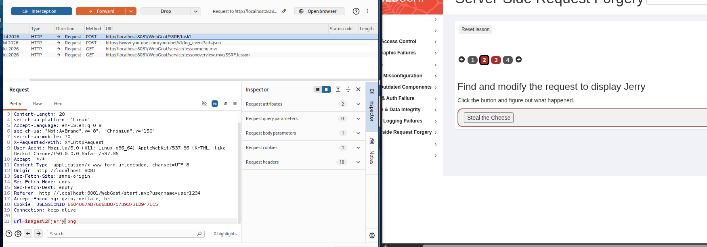 
   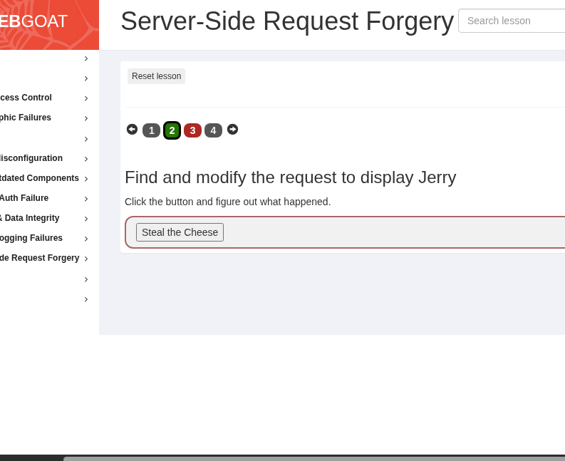
2. **Запит до зовнішнього ресурсу (Крок 3):**
   Оскільки принцип експлуатації на наступному кроці ідентичний, запит від кнопки "try this" також було перехоплено в Burp Suite. Цього разу параметр `url` у тілі запиту було підмінено на цільовий зовнішній ресурс: `url=http://ifconfig.pro`. 
   Сервер успішно виконав виклик до стороннього сайту, підтвердивши наявність вразливості.
   
   *Скріншот 2: Успішно виконане завдання (Крок 3) з відображенням результату у веб-інтерфейсі.*
   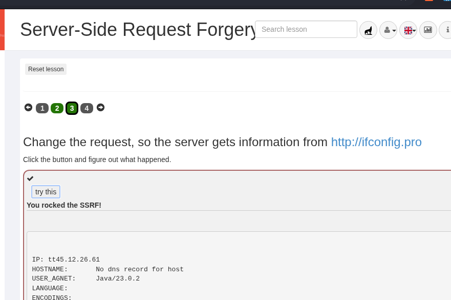