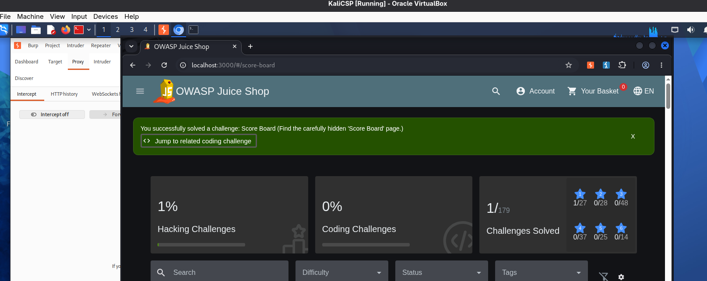
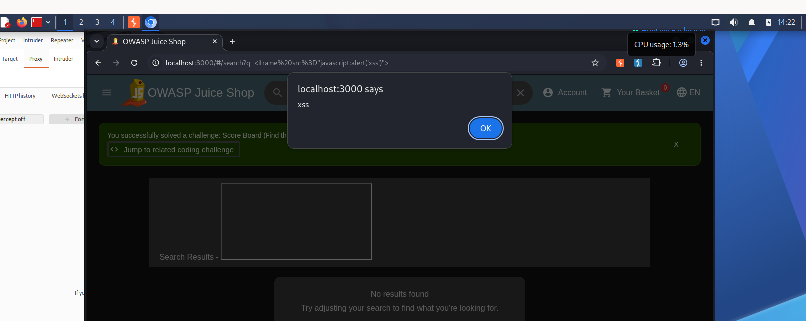
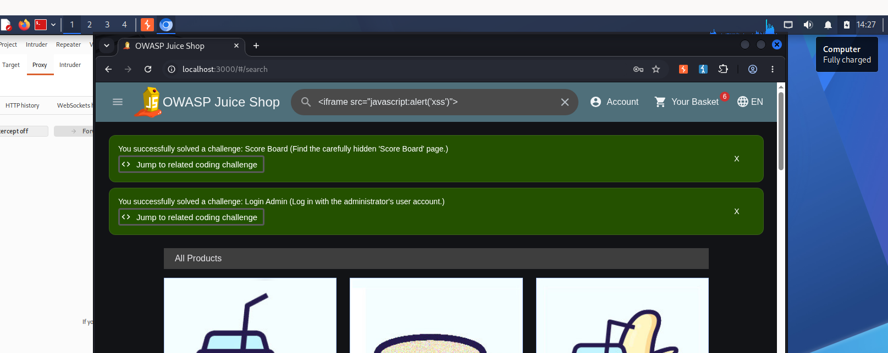
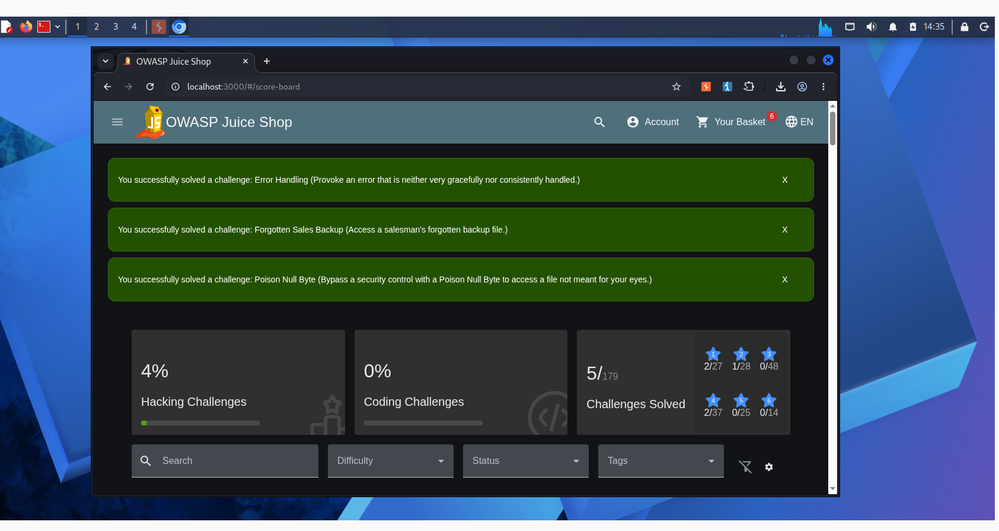
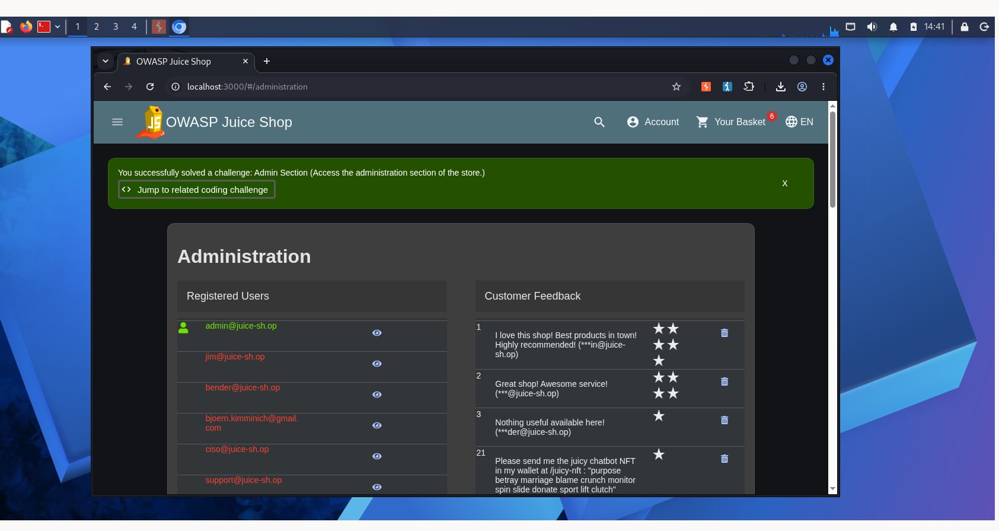
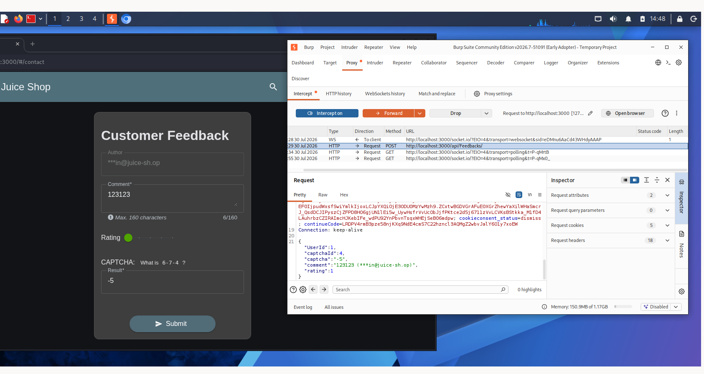
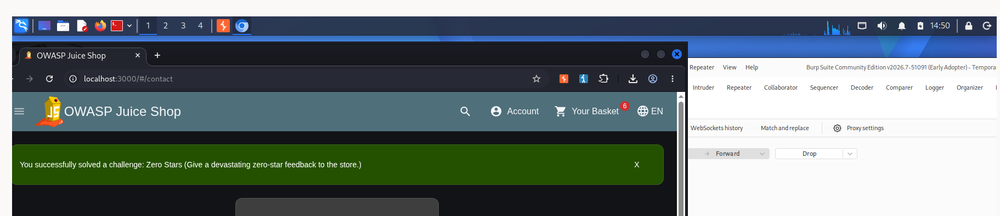

# Звіт про проходження завдань OWASP Juice Shop

**Дата виконання:** 30 липня 2026
**Середовище:** Kali Linux (VirtualBox), Google Chrome, Burp Suite Community Edition v2026.7
**Ціль:** OWASP Juice Shop, `http://localhost:3000`

Нижче наведено опис проходження восьми завдань (challenges) застосунку OWASP Juice Shop. Прогрес фіксувався через вбудовану Score Board (`/#/score-board`), яка автоматично позначає завдання як вирішені зеленим банером.

---

## 1. Score Board — «Find the carefully hidden 'Score Board' page»
**Складність:** ★☆☆☆☆ (1)
**Категорія:** Sensitive Data Exposure

### Опис
Score Board — сторінка, яка не має прямого посилання в інтерфейсі магазину, але доступна за прямим URL.

### Кроки виконання
1. Відкрив застосунок за адресою `localhost:3000`.
2. Перейшов напряму за адресою `localhost:3000/#/score-board`.
3. Сторінка завантажилась, система автоматично зарахувала завдання як виконане.

### Результат
Отримано банер підтвердження: *«You successfully solved a challenge: Score Board»*.



---

## 2–3. DOM XSS (пошук) та Login Admin

### 2. DOM XSS — «Perform a DOM XSS attack in the search field»
**Складність:** ★★☆☆☆ (2)
**Категорія:** Cross-Site Scripting (XSS)

#### Опис
Поле пошуку товарів відображає введений текст без належної санітизації, що дозволяє виконати DOM-based XSS.

#### Кроки виконання
1. Перейшов у поле пошуку магазину.
2. Ввів корисне навантаження:
   ```html
   <iframe src="javascript:alert('xss')">
   ```
3. Скрипт виконався одразу під час рендерингу результатів пошуку — з'явилось спливаюче вікно `alert('xss')`.

#### Результат
Підтверджено виконання довільного JavaScript-коду через параметр пошуку.



### 3. Login Admin — «Log in with the administrator's user account»
**Складність:** ★★★☆☆ (3)
**Категорія:** Injection

#### Опис
Форма логіну не екранує вхідні дані, що уможливлює SQL-ін'єкцію в поле email і обхід перевірки пароля.

#### Кроки виконання
1. Перейшов на сторінку `/#/login`.
2. У полі Email ввів класичний SQLi-payload для обходу автентифікації:
   ```sql
   ' OR 1=1--
   ```
3. У полі Password ввів будь-яке значення.
4. Запит `SELECT * FROM Users WHERE email = '' OR 1=1--' AND password = '...'` повернув перший запис таблиці — обліковий запис адміністратора (`admin@juice-sh.op`), під яким і відбувся вхід в систему.

#### Результат
Систему пройдено від імені адміністратора магазину; на скріншоті видно два зелені банери — Score Board та Login Admin — обидва вже зараховані на момент перевірки пошукового поля.



---

## 4. Error Handling, Forgotten Sales Backup, Poison Null Byte

### 4.1 Error Handling — «Provoke an error that is neither gracefully nor consistently handled»
**Складність:** ★☆☆☆☆ (1)
**Категорія:** Improper Error Handling

#### Опис
Мета — змусити сервер повернути неопрацьований виняток (stack trace) замість коректного повідомлення про помилку, наприклад, шляхом підстановки некоректного значення ID в API-запит (напр. `/rest/basket/1abc` замість числового ID).

#### Результат
Отримано необроблену помилку сервера (stack trace), яку застосунок не приховав від користувача — завдання зараховано.

### 4.2 Forgotten Sales Backup — «Access a salesman's forgotten backup file»
**Складність:** ★★☆☆☆ (2)
**Категорія:** Sensitive Data Exposure

#### Опис
На FTP-подібному ендпоінті `/ftp` міститься список файлів, серед яких — застарілий backup-файл, доступ до якого офіційно заборонено правилами `.htaccess`, але сам файл фізично присутній на сервері.

#### Кроки виконання
1. Переглянув вміст директорії `localhost:3000/ftp`.
2. Знайшов файл `sales.xlsx.bak` (backup звіту продажів).
3. Завантажив файл напряму за прямим посиланням, обійшовши обмеження, орієнтоване лише на розширення `.bak` у правилах доступу.

#### Результат
Файл успішно отримано — завдання зараховано.

### 4.3 Poison Null Byte — «Bypass a security control with a Poison Null Byte»
**Складність:** ★★★★☆ (4)
**Категорія:** Broken Access Control

#### Опис
Перевірка розширення файлу на сервері виконується до моменту фактичного зчитування шляху, тому додавання null-байта (`%00`) в кінці «дозволеного» розширення дозволяє обрізати рядок шляху та отримати доступ до файлу з іншим (забороненим) розширенням.

#### Кроки виконання
1. Сформував запит до `/ftp/`, додавши до імені захищеного файлу послідовність `%2500` (URL-encoded null byte).
2. Сервер перевірив лише «дозволену» частину розширення, а після null-байта проігнорував залишок шляху під час фактичного читання файлу.
3. Отримано доступ до файлу, який мав бути недоступний напряму.

#### Результат
Захист обійдено, завдання зараховано.

### Загальний результат для блоку
Три завдання зараховано одночасно — на скріншоті Score Board видно три нові зелені банери, а лічильник прогресу зріс до **5 з 179** вирішених завдань.



---

## 5. Admin Section — «Access the administration section of the store»
**Складність:** ★★☆☆☆ (2)
**Категорія:** Broken Access Control

### Опис
Посилання на адмін-панель відсутнє в основному меню, однак сторінка не захищена перевіркою ролі на клієнті — достатньо знати прямий шлях.

### Кроки виконання
1. Перейшов напряму за адресою `localhost:3000/#/administration`.
2. Оскільки на попередньому кроці вхід був виконаний під обліковим записом адміністратора (Login Admin), доступ до розділу було надано без додаткових перешкод.

### Результат
Відкрито панель адміністрування зі списком зареєстрованих користувачів та відгуків клієнтів. Завдання зараховано: *«You successfully solved a challenge: Admin Section»*.



---

## 6–7. Zero Stars (з використанням Burp Suite)
**Складність:** ★★★☆☆ (3)
**Категорія:** Improper Input Validation
**Це завдання обрано додатково, самостійно (поза базовим набором прикладів).**

### Опис
Форма зворотного зв'язку («Customer Feedback») дозволяє виставити рейтинг від 1 до 5 зірок через слайдер на клієнті — значення 0 інтерфейс поставити не дає. Проте валідація мінімального значення рейтингу виконується лише на стороні клієнта (JavaScript), тому змінити значення в самому HTTP-запиті можна безперешкодно.

### Кроки виконання
1. Запустив Burp Suite, налаштував перехоплення трафіка браузера (Proxy → Intercept on).
2. На сторінці `/#/contact` заповнив форму зворотного зв'язку: коментар `123123`, розв'язав капчу (приклад: «What is 6-7-4?» → відповідь `-5`), рейтинг залишив мінімально можливим через UI.
3. Під час відправки форми Burp перехопив POST-запит на `/api/Feedbacks/` з JSON-тілом:
   ```json
   {
     "UserId": 1,
     "captchaId": 4,
     "captcha": "-5",
     "comment": "123123",
     "rating": 1
   }
   ```
4. У вкладці Request змінив значення поля `"rating"` з `1` на `0`.
5. Натиснув Forward, щоб відправити змінений запит на сервер.

### Результат
Сервер прийняв недопустиме через UI значення рейтингу (0 зірок), оскільки перевірка діапазону значень існувала лише в браузері. Отримано підтвердження: *«You successfully solved a challenge: Zero Stars (Give a devastating zero-star feedback to the store.)»*.




---